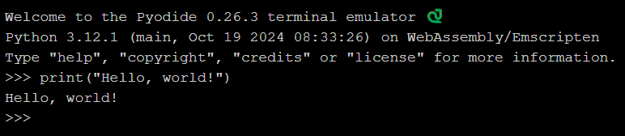
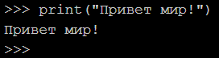
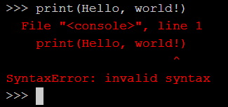
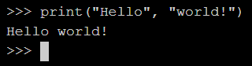
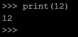
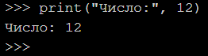

# Знакомство с онлайн-терминалом
- Для твоего удобства я сделал [онлайн терминал]([[Python Terminal]]), чтобы тебе не приходилось на начальном этапе ничего устанавливать и париться - просто берешь и прямо в онлайн-терминале кодишь. Но не переживай, в конце курса мы обязательно установим питон на твой компуктер, чтобы можно было программировать без подключению к интернету у себя на устростве.
- # Hello, World!
- Начнём с классической первой программы на любом языке программирования — `Hello, World!`.
- Это простая программа, которая выводит на экран текст "Hello, world!". В Python это делается с помощью функции `print()`. Введи в онлайн-терминале следующую команду и жмякай *Enter*:
- ```python
  print("Hello, world!")
  ```
- #+BEGIN_TIP
  На клавиатуре есть 3 самые важные клавиши программиста: `Ctrl`, `C`, `V`. 
  Почему именно они? Всё просто!
  `Ctrl + C` - копировать
  `Ctrl + V` - вставить
  Эти две горячии клавиши - незаменимый инструмент разработчика!
  #+END_TIP
- Должно получиться как-то так:
- 
- > Поздравляю! Начало положено, обратного пути нет...
- Как можно заметить - после запуска этой команды терминал выведет текст, который находится внутри ковычек.
- Но давай её разберем по частям, чтобы ты понимал, как она работает.
- `print()` (с английского `печатать`) - [[функция]], которая выводит в терминал *объекты* переданные в функцию между скобками в виде текста.
- `"Hello, world!"` - [[строка]] с текстом, которую мы передаем в функцию.
  
  #+BEGIN_IMPORTANT
  Заметьте, что текст заключен в двойные кавычки `"` - это **ОЧЕНЬ ВАЖНО**! Так питон понимает, что сейчас будет текст, а не числа или [[другие типы данных]].
  #+END_IMPORTANT
- Теперь я тебе предлагаю поиграться с функцией:
	- Попробуй изменить текст внутри кавычек
	  collapsed:: true
		- 
	- Что будет, если убрать кавычки?
	  collapsed:: true
		- 
	- Что будет, если написать строки через запятую?
	  collapsed:: true
	  ```python
	  print("Hello", "world!")
	  ```
		- 
		- #+BEGIN_TIP
		  Функция может принимать несколько *объектов* и сама поставит между ними пробел!
		  #+END_TIP
	- Что будет, если вместо *строки* будет *число*?
	  collapsed:: true
		- 
	- Что если и *строка*, и *число*?
	  collapsed:: true
		- 
- #+BEGIN_TIP
  Почему функция `print()`ведет себя так как ведет - мы обсудим, даже напишем свою, но позже в этом курсе 🤓
  #+END_TIP
- # Базовые операции с числами
- В программировании без чисел никуда. С ними постоянно, что-то нужно делать. Python поддерживает различные математические операции. Попробуй позапускать следующие команды:
- ```python
  print(2 + 3)      # сложение
  print(7 - 4)      # вычитание
  print(3 * 4)      # умножение
  print(8 / 2)      # деление
  print(10 // 3)    # целочисленное деление
  print(2 ** 3)     # возведение в степень
  ```
- # Итог
- В данном уроке мы познакомились с онлайн-терминалом и написали простенькую программу и немного поигрались с функцией `print()`.